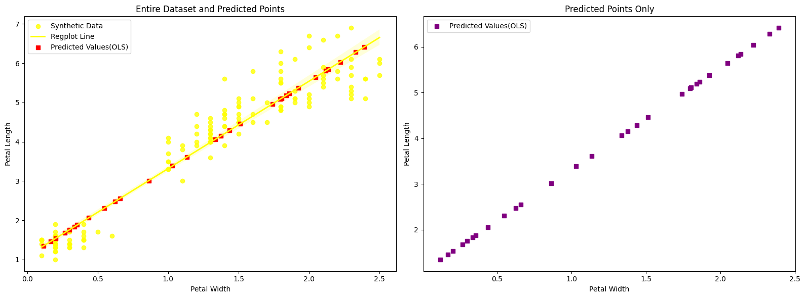

# Morphological Characteristics of Iris Flowers

# Introduction:

*This report presents a correlation analysis of iris petals and sepals, exploring the significant correlation between their width and length. The dataset includes measurements from 150 iris flowers categorized into three subspecies: Iris Setosa, Iris Versicolor, and Iris Virginica, with four measurements each, including petal and sepal width and length.*

## Hypotheses

To guide the analysis, two hypotheses were formulated:

- **Null Hypothesis ($H_{0a}$):** No significant correlation exists between petal length ($X$) and width ($Y$).

- **Alternative Hypothesis ($H_{1a}$):** A significant correlation exists between petal length ($X$) and width ($Y$).

## Method and Analysis Approach

The analysis involves:

- Examining scatter distributions of petals and sepals for potential linear relationships.

- Calculating bivariate correlation Pearson's $r$ between width and length for both petals and sepals.

- Evaluating the significance of the correlation based on $r$- and $p$-values.

- In case of a significant correlation, using a linear regression model ($Y = \beta_0 + \beta_1X + \varepsilon$) for in-sample predictions.

# Analysis

## Petal Scatter Plot

A closer look at the scatter distribution of petals suggests a linear relationship between width and length, despite the presence of a measurement gap. Nevertheless, overall trends show a linear connection between width and length.

## Sepal Scatter Plot

In contrast to petals, the scatter distribution for sepals does not reveal a clear correlation. However, a subdivision based on subspecies provides a more differentiated picture, especially for Iris Setosa, where a certain correlation is observed.

## Correlation Heatmap

A comprehensive consideration of a correlation heatmap for the entire dataset confirms previous observations. For sepals, a low correlation between width and length is reflected across the dataset, but a subdivision by subspecies shows some correlation, especially for Versicolor. For petals, there is an overall correlation, but when divided by subspecies, a weaker connection between width and length emerges.

# Answer to Hypotheses

The results from the conducted correlation analysis provide support for drawing conclusions regarding the formulated hypotheses.

- **Null Hypothesis ($H_{0a}$):**
  Based on the analysis of the morphological characteristics of petals, we cannot reject the null hypothesis ($H_{0a}$) of no significant correlation between petal length ($X$) and width ($Y$). The results do not provide sufficient evidence to demonstrate the absence of a correlation.

- **Alternative Hypothesis ($H_{1a}$):**
  On the other hand, the results strongly support the alternative hypothesis ($H_{1a}$), postulating a significant correlation between petal length ($X$) and width ($Y$). Statistical analyses and calculations clearly show a significant correlation between these morphological characteristics.
  

# Conclusions

- For petal measurements, a significant correlation between width and length is observed, suggesting that a linear regression model is suitable for predictions within the sample.

- In sepal measurements, a significant correlation between width and length cannot be established across the entire dataset. However, a differentiated analysis based on subtypes may provide additional insights and support more optimized regression models, especially for Iris setosa.

- This report not only provides insights into the correlation among iris flower measurements but also emphasizes the importance of a differentiated analysis based on subtypes for a deeper understanding of the observed relationships.

## Predicted Points Visualization

# Development of Thoughts and Plots

The choice of conducting a correlation analysis on iris flower measurements stems from the need to understand the inherent relationships within different morphological characteristics. By examining scatter distributions and calculating correlations, the aim is to uncover patterns and determine if linear models are applicable.

The scatter distribution of petals reveals a consistent linear trend, despite some measurement gaps. This suggests a straightforward relationship between petal width and length. On the other hand, sepals exhibit a less clear correlation, emphasizing the importance of delving into subtypes for a more nuanced understanding. The correlation heatmap provides a visual representation, confirming initial observations. For sepals, the low correlation across the dataset indicates a diverse relationship. However, upon closer inspection by subspecies, particularly for Versicolor, notable correlations emerge. Petals, overall, showcase correlation, but the subdivision highlights variations within each subspecies. In conclusion, while petal measurements strongly support a significant correlation, sepal measurements require a more refined analysis based on subtypes. The report underscores the necessity of a nuanced approach when interpreting correlations among iris flower measurements, emphasizing the importance of subtype-specific analyses for a comprehensive understanding.